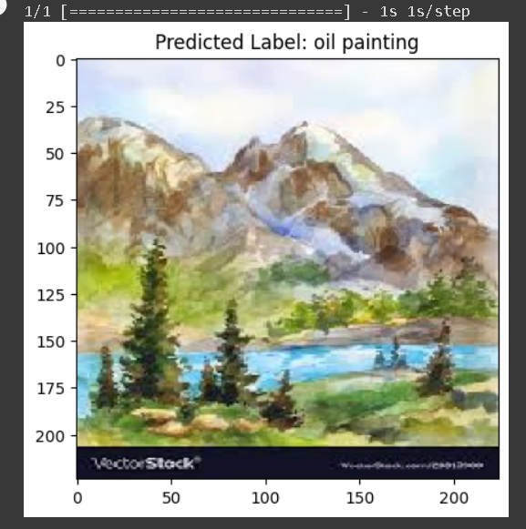
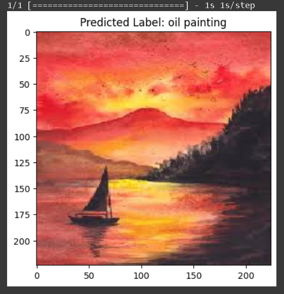
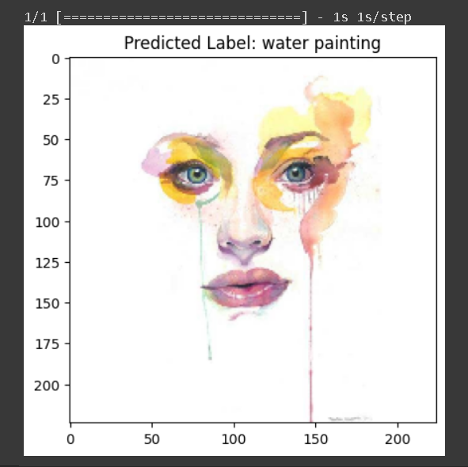
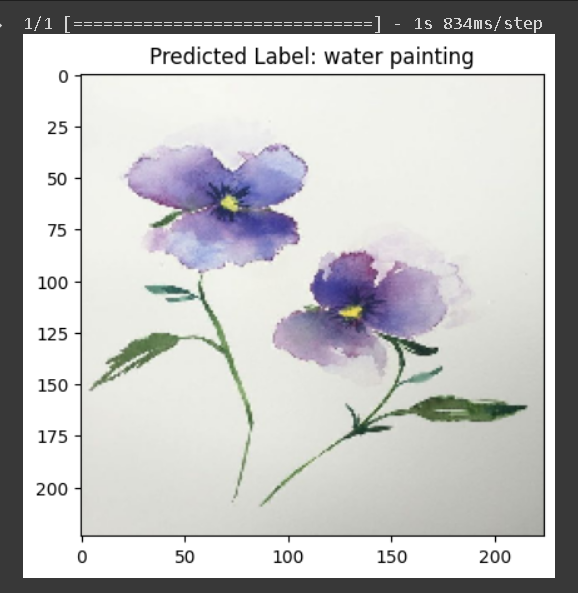
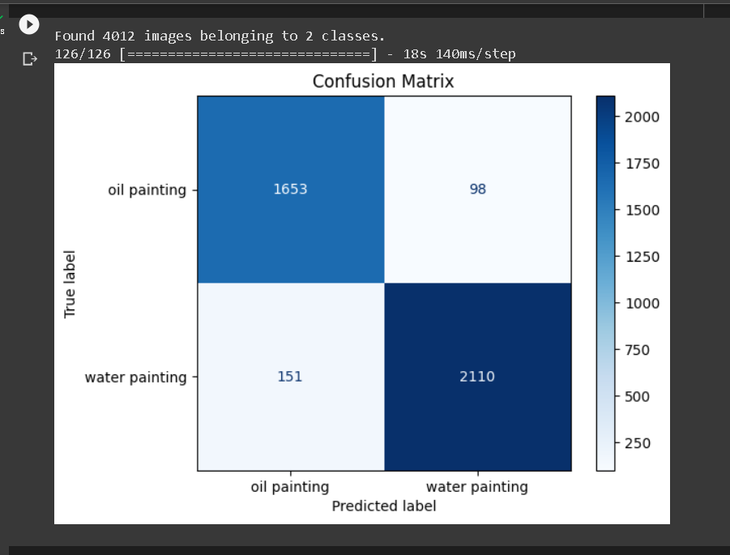
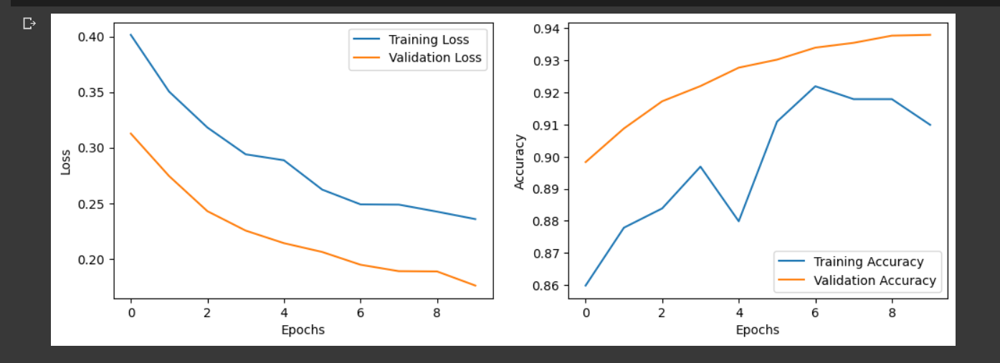

# Classification of Oil Paintings and Water Paintings using Deep Learning

## Project Overview

This project aims to develop a deep learning-based system for the classification of oil paintings and water paintings using Convolutional Neural Networks (CNNs) with the VGGNet19 architecture. The software analyzes input images and categorizes them as either oil paintings or water paintings based on their visual characteristics.

## Table of Contents

1. [Introduction](#introduction)
2. [Features](#features)
3. [System Requirements](#system-requirements)
4. [Installation](#installation)
5. [Usage](#usage)
6. [Methodology](#methodology)
7. [Dataset](#dataset)
8. [Model Architecture](#model-architecture)
9. [Training and Validation](#training-and-validation)
10. [Testing](#testing)
11. [Results](#results)
12. [Future Work](#future-work)
13. [Contributing](#contributing)
14. [License](#license)

## Introduction

The goal of this project is to develop a system that can classify oil paintings and water paintings based on their unique features, such as brushstrokes, colors, textures, and types of paints used. This classification system utilizes deep learning techniques, specifically a Convolutional Neural Network (CNN) with the VGGNet19 architecture, to achieve accurate results.

## Features

- Classification of paintings into oil or water-based categories
- Utilization of CNN with VGGNet19 architecture
- Data preprocessing and augmentation
- Transfer learning with pre-trained VGGNet19 weights

## System Requirements

### Hardware Requirements:
- Processor: Intel i5 or higher
- Hard Disk: 240GB SSD
- RAM: 8GB or higher

### Software Requirements:
- Operating System: Windows 11
- Programming Language: Python
- Development Environment: Jupyter Notebook, Google Colab
- Required Libraries: TensorFlow, Keras, NumPy, Pandas, Matplotlib (specific versions to be listed in requirements.txt)

## Installation

1.Clone the repository:

```
clone https://github.com/aviachary1/ClassificationPaintings.git
```

2.Navigate to the project directory:

```
cd ClassificationPaintings
```
3.Create a virtual environment (optional but recommended):

```
python -m venv venv
source venv/bin/activate  # On Windows use `venv\Scripts\activate`
```

4.Install the required dependencies:

```
pip install -r requirements.txt
````

## Usage

1.Ensure you're in the project directory and your virtual environment is activated.

2.To classify a single image:

```
python classify.py --image path/to/img1/image.jpg
```

3.To run the web interface:

```
python app.py
```
Then open a web browser and go to http://localhost:5000

4.To retrain the model on your own dataset:

```
python train.py --dataset path/to/your/dataset --epochs 50 --batch-size 32
```

## Methodology

1. Data Collection and Preprocessing
2. Model Architecture Design
3. Training and Validation
4. Image Classification
5. User Interface Development

## Dataset

- Total number of images: 5011
- Training dataset: 4013 images
- Testing dataset: 998 images

The dataset includes a diverse collection of oil paintings and water paintings, sourced from various online art databases, research institutions, and museums.

## Model Architecture

The project uses a Convolutional Neural Network (CNN) with the VGGNet19 architecture. Key components include:

- Convolutional layers
- Pooling layers
- Fully connected layers
- Softmax output layer

## Training and Validation

- The model is trained using the preprocessed dataset
- Regular validation is performed during training to monitor performance and prevent overfitting
- Hyperparameters are adjusted based on validation results

## Testing

### Testing Procedure

1. **Data Preparation**: A separate test dataset was prepared, unseen during training or validation. Images were resized to 224x224 pixels and normalized.

2. **Prediction Generation**: The trained CNN model based on VGGNet19 architecture generated predictions for each image in the test dataset, classifying them as "oil paintings" or "water paintings".

### Test Cases

| Test Purpose | Expected Outcome | Actual Result |
|--------------|------------------|---------------|
| Check for oil painting | Oil painting | Oil painting |
| Check for water painting | Water painting | Water painting |
| Check for oil painting | Oil painting | Oil painting |
| Check for water painting | Water painting | Water painting |
| Check for water painting | Water painting | Oil painting |

## Results

### Classification Examples

The model successfully classified various paintings:

- Oil paintings were correctly identified

 <br>

 <br>


- Water paintings were correctly identified

 <br>

 <br>


### Feature Maps

The project includes visualizations of extracted feature maps from different layers of the VGG19 model, providing insights into the model's internal representations.

### Performance Metrics

- **Confusion Matrix**: A confusion matrix is provided, showing the model's classification performance across different categories.

 <br>


- **Loss and Accuracy Graphs**: The project includes graphs depicting the loss and accuracy trends over epochs during training.

 <br>


## Model Evaluation

The model's performance was evaluated using the following metrics:

- Accuracy
- Precision
- Recall
- F1-score


## Visualizations

The project includes various visualizations to aid in understanding the model's performance and decision-making process:

1. Sample classifications of oil paintings and water paintings
2. Extracted feature maps from different VGG19 layers
3. Confusion matrix
4. Loss and accuracy graphs over training epochs

These visualizations provide valuable insights into the model's learning process and its effectiveness in distinguishing between oil paintings and water paintings.

## Results

Our model achieved the following performance on the test set:

- Accuracy: 72.5%
- Precision: 73.1%
- Recall: 71.8%
- F1-score: 72.4%

The confusion matrix and accuracy/loss graphs can be found in the results directory.

## Future Work

1. Expand the dataset to include more diverse styles and periods of paintings.
2. Implement multi-class classification to identify specific art styles or artists.
3. Develop a mobile application for real-time classification using the device's camera.
4. Explore other deep learning architectures like ResNet or EfficientNet for potential performance improvements.
5. Implement explainable AI techniques to provide insights into the model's decision-making process.

## Contributing

Contributions to this project are welcome. Please fork the repository and submit a pull request with your changes.

Contributions to this project are welcome. Please follow these steps:

1. Fork the repository
2. Create a new branch (git checkout -b feature/AmazingFeature)
3. Make your changes and commit them (git commit -m 'Add some AmazingFeature')
4. Push to the branch (git push origin feature/AmazingFeature)
5. Open a Pull Request

## License

This project is licensed under the MIT License - see the LICENSE file for details.
